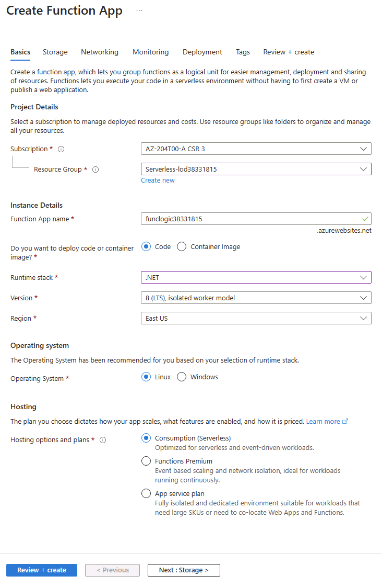

---
lab:
    az204Title: 'Lab 02: Implement task processing logic by using Azure Functions'
    az204Module: 'Learning Path 02: Implement Azure Functions'
---

# Lab 02: Implement task processing logic by using Azure Functions

## Microsoft Azure user interface

Given the dynamic nature of Microsoft cloud tools, you might experience Azure UI changes that occur after the development of this training content. As a result, the lab instructions and lab steps might not align correctly.

Microsoft updates this training course when the community alerts us to needed changes. However, cloud updates occur frequently, so you might encounter UI changes before this training content updates. **If this occurs, adapt to the changes, and then work through them in the labs as needed.**

## Multi Path Labs

This lab has been structured to give learners a choice in their lab experience. There are three approaches to progress through this lab

- Path 1 (Low-Code - quick or non-dev approach)
- Path 2 (Standard - typical lab implementation - recommended)
- Path 3 (Advanced - limited code given)

## Instructions

### Before you start

#### Sign in to the lab environment

Sign in to your Windows 11 virtual machine (VM) by using the following credentials:

- Username: `Admin`
- Password: `Pa55w.rd`

> **Note**: Your instructor will provide instructions to connect to the virtual lab environment.

#### Review the installed applications

Find the taskbar on your Windows 11 desktop. The taskbar contains the icons for the applications that you'll use in this lab, including:

- Microsoft Edge
- File Explorer
- Terminal
- Visual Studio Code

## Lab Scenario

In this lab, you will demonstrate the ability to create a simple Azure function that echoes text that is entered and sent to the function by using HTTP POST commands. This will illustrate how the function can be triggered over HTTP. 

Additionally, you will demonstrate how to execute an Azure function by setting it to execute on a fixed schedule. The function will write a message to a log each time the schedule is triggered.

Finally, you will demonstrate how an Azure function can connect to other Azure resources, such as a storage account. The function will connect to a storage account that you create and return the contents of a file that is stored in the Azure storage account.

<em>View this video by right-clicking this **[video link](https://youtu.be/-3tneDvkYDo)** and select 'Open link in a new tab / new window'.</em>

 

### Architecture diagram

### Exercise 1: Create Azure resources

#### Task 1: Open the Azure portal

1. On the taskbar, select the **Microsoft Edge** icon.
1. In the browser window, browse to the Azure portal at `https://portal.azure.com`, and then sign in with the account you'll be using for this lab.

    > **Note**: If this is your first time signing in to the Azure portal, you'll be offered a tour of the portal. If you prefer to skip the tour, select **Get Started** to begin using the portal.

#### Task 2: Create an Azure Storage account

1. In the Azure portal, use the **Search resources, services, and docs** text box to search for **Storage Accounts**, and then, in the list of results, select **Storage Accounts**.

1. On the **Storage accounts** blade, select **+ Create**.

1. On the **Create a storage account** blade, on the **Basics** tab, perform the following actions, and then select **Review**:

    | Setting | Action |
    | -- | -- |
    | **Subscription** drop-down list | Retain the default value |
    | **Resource group** section | Select **Create new**, enter **Serverless**, and then select **OK** |
    | **Storage account name** text box | Enter **funcstor**_[yourname]_ |
    | **Region** drop-down list | Select **(US) East US** |
    | **Performance** section | Select the **Standard** option |
    | **Redundancy** drop-down list | Select **Locally-redundant storage (LRS)** |

    The following screenshot displays the configured settings in the **Create a storage account** blade.

    

1. On the **Review** tab, review the options that you selected during the previous steps.

1. Select **Create** to create the storage account by using your specified configuration.

    > **Note**: Wait for the creation task to complete before you proceed with this lab.

1. On the **Overview** blade, select the **Go to resource** button to navigate to the blade of the newly created storage account.

1. On the **Storage account** blade, in the **Security + networking** section, select **Access keys**.

1. On the **Access keys** blade, select **Show keys**.

1. On the **Access keys** blade, review any one of the **Connection string**s (using **Show** button), and then record the value of either **Connection string** boxes in Notepad. The **Key**s are platform managed encryption keys and are **not** used for this lab.

   > **Note**: It doesn't matter which connection string you choose. They are interchangeable.

1. Open Notepad, and then paste the copied connection string value to Notepad. You'll use this value later in this lab.

#### Task 3: Create a function app

1. On the Azure portal's navigation pane, select the **Create a resource** link.

1. On the **Create a resource** blade, in the **Search services and marketplace** text box, enter **Function**, and then select Enter.

1. On the **Marketplace** search results blade, select the **Function App** result.

1. On the **Function App** blade, select **Create**.

1. On the **Create Function App** blade, on the **Basics** tab, perform the following actions, and then select **Next: Storage**:

    | Setting | Action |
    | -- | -- |
    | **Subscription** drop-down list | Retain the default value |
    | **Resource group** section | Select **Serverless** |
    | **Function App name** text box | Enter **funclogic**_[yourname]_ |
    | **Publish** section | Select **Code** |
    | **Runtime stack** drop-down list | Select **.NET** |
    | **Version** drop-down list | Select **8 (LTS),  isolated worker model ** |
    | **Region** drop-down list | Select the **East US** region |
    | **Operating System** option | Select **Linux** |
    | **Plan type** drop-down list | Select **Consumption (Serverless)** |

    The following screenshot displays the configured settings in the **Create Function App** blade.

    

1. On the **Storage** tab, perform the following actions, and then select **Review + create**:

    | Setting | Action |
    | -- | -- |
    | **Storage account** drop-down list | Select the **funcstor**_[yourname]_ storage account |

1. On the **Review + create** tab, review the options that you selected during the previous steps.

1. Select **Create** to create the function app by using your specified configuration.

    > **Note**: Wait for the creation task to complete before you move forward with this lab.

#### Review

In this exercise, you created all the resources that you'll use in this lab.
